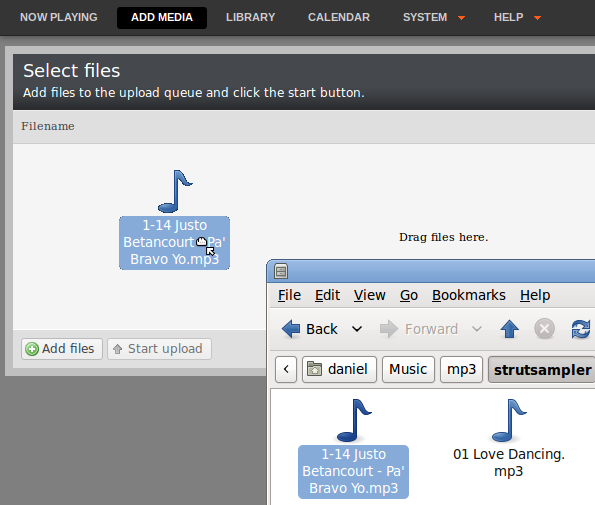
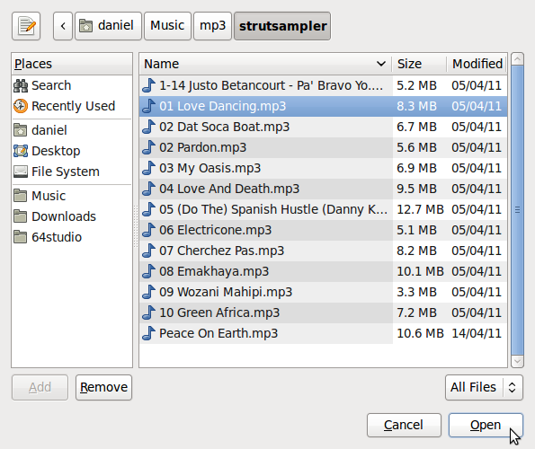
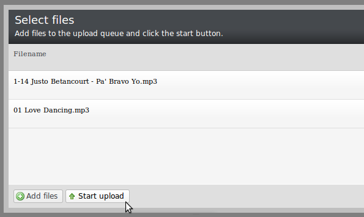
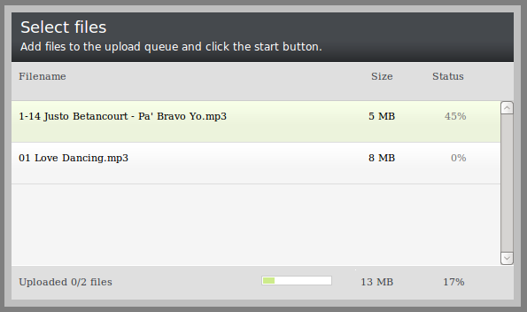
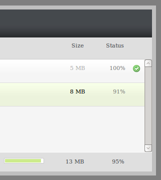

If you do not have direct access to the Airtime server, you can add files to the Airtime library using the **Add Media** page of the administration interface. (The **Add Media** page is not visible to *Guest* users). This page includes an upload queue for media files, which supports drag and drop from your computer's file manager if you are using a recent web browser, such as *Mozilla Firefox 16* or later.

Some web browsers may set an upload limit for a single file, between 200MB and 2GB. If you need to upload files larger than 200MB to the Airtime server on a regular basis, you may find it more convenient to perform the upload using SFTP, rather than through the browser. See the chapter *Automated file import* for more details.

If your web browser does not support drag and drop, you can use the **Add files** button, which has a white plus sign in a green circle icon, to open a file selection window on your computer.

After you have added all the files that you require to the upload queue, click the **Start upload** button, which has a green arrow icon.

The row of the file currently being uploaded is highlighted in pale green. At the bottom of the upload queue, a progress bar and percentage indicates how much of the upload has taken place so far. The upload speed will depend on the network connection between your computer and the Airtime server.

Once it has been uploaded successfully, each file row displays a white check mark in a green circle icon.

 

Your files are now imported into the Airtime library, ready to be included in your broadcast playlists, smart blocks and shows.
