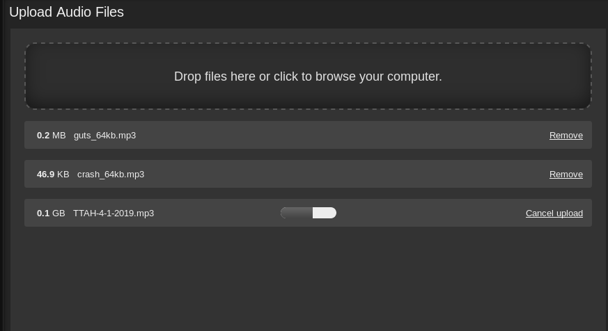

# Upload
The primary way you can add files to the LibreTime library is using the
**Upload** page of the administration interface. (The **Upload** page is not
visible to *Guest* users). This page includes an upload queue for media files,
which supports drag and drop from your computer's file manager if you are using
a recent web browser, such as *Mozilla Firefox 16* or later.

Some web browsers may set an upload limit for a single file, between 200MB and
2GB. In addition the default LibreTime webserver configuration limits file size
to 500M.  If you need to upload files larger than 500MB to the LibreTime server
on a regular basis, you will need to have your admin update the configuration at
`/etc/apache2/sites-available/airtime.conf `. Airtime previously supported
import via SFTP but this functionality is still under development for LibreTime.

If your web browser does not support drag and drop, you can click the background
of the screen on the **Upload page**, to open up a file browser dialog.
LibreTime will automatically attempt to upload files once you select them. You
can track the file upload progress via the gray progress bar in the upload
window.

The upload speed will depend on the network connection between your computer and
the LibreTime server. While files are uploading you need to keep this browser
window open or it will interrupt the file transfer.

After the file transfer is complete, the file is then processed by the analyzer
service and if it has been succesfully uploaded the **Import Status** will
change from **Pending Import** to **Succesfully imported**. If it fails there
was some reason your file was rejected by LibreTime and you will need to try
again or contact your Admin to have them consult the logs and open up a bug
report. It sometimes takes a few minutes for files to be processed but if they
are all stuck at **Pending Import** then it is possible that the
*airtime_analyzer* process has crashed and the admin will need to restart it.
See [Troubleshooting](../troubleshooting) for more information. You can look
specifically at any failed imports by clicking the radio button next to Failed.

Once they are done procesing your files ready to be included in your broadcast
playlists, smart blocks and shows and can be viewed in the [Tracks](../Tracks)
section of the Library.
